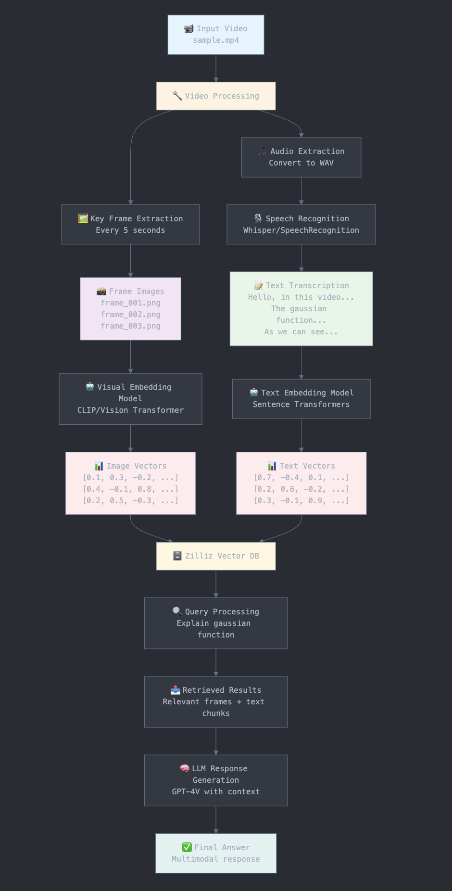

# 🎥 FrameWhisper - Video RAG System

A comprehensive multimodal RAG (Retrieval-Augmented Generation) system that processes video content, extracts key frames, transcribes audio, and enables intelligent video querying through AI-powered chat.

## 🚀 Features

### **Core Functionality**
- **Video Processing**: Extract key frames using FFmpeg
- **Audio Transcription**: Convert video audio to text using AssemblyAI
- **Text Chunking**: Multiple strategies (standard, sentence-based, timestamp-aware)
- **Vector Embeddings**: Generate embeddings for text (Google Gemini) and visual data (CLIP via Hugging Face)
- **Vector Database**: Store and search embeddings using Zilliz/Milvus
- **AI Chat Interface**: Query videos using natural language

### **Advanced Features**
- **Multimodal Search**: Combine visual and textual understanding
- **Real-time Processing**: Live progress tracking during video analysis
- **Smart Chunking**: Optimized text segmentation for better retrieval
- **Debug Tools**: Comprehensive debugging and monitoring endpoints
- **Security**: JWT authentication, rate limiting, and input validation

## 🏗️ Architecture




## 🛠️ Tech Stack

### **Frontend**
- **React 18** with TypeScript
- **Vite** for fast development
- **Tailwind CSS** for styling
- **Shadcn/ui** components
- **React Router** for navigation
- **React Query** for state management

### **Backend**
- **Node.js** with Express
- **MongoDB** with Mongoose
- **JWT** authentication
- **Multer** for file uploads
- **FFmpeg** for video processing
- **AssemblyAI** for transcription

### **AI & ML**
- **Google Gemini** for text embeddings and generation
- **CLIP** (Hugging Face) for visual embeddings
- **Zilliz/Milvus** for vector storage and search

## 📦 Installation

### **Prerequisites**
- Node.js 18+ 
- MongoDB
- FFmpeg
- Zilliz Cloud account

### **1. Clone Repository**
```bash
git clone https://github.com/yourusername/framewhisper.git
cd framewhisper
```

### **2. Backend Setup**
```bash
cd backend
npm install
cp .env.example .env
# Fill in your environment variables
npm run dev
```

### **3. Frontend Setup**
```bash
cd frontend
npm install
npm run dev
```

## ⚙️ Environment Variables

### **Backend (.env)**
```env
PORT=4000
NODE_ENV=development
DEV_MONGODB_URI=your_mongodb_connection_string
JWT_SECRET_KEY=your_jwt_secret
GEMINI_API_KEY=your_gemini_api_key
DEV_EMBEDDING_MODEL=text-embedding-004
DEV_GENERATIVE_MODEL=gemini-1.5-flash
MILVUS_ENDPOINT_ADDRESS=your_zilliz_endpoint
MILVUS_TOKEN=your_zilliz_token
ASSEMBLYAI_API_KEY=your_assemblyai_api_key
HUGGING_FACE_TOKEN=your_hf_token  # Optional
```

### **Frontend (.env.local)**
```env
VITE_API_BASE_URL=http://localhost:4000/api/v1
```

## 🚀 Quick Start

### **1. Start Backend**
```bash
cd backend
npm run dev
```

### **2. Start Frontend**
```bash
cd frontend
npm run dev
```

### **3. Access Application**
- Frontend: http://localhost:5173
- Backend API: http://localhost:4000
- Health Check: http://localhost:4000/health

## 📡 API Endpoints

### **Authentication**
- `POST /api/v1/auth/signup` - User registration
- `POST /api/v1/auth/signin` - User login

### **Video Management**
- `POST /api/v1/video/upload` - Upload and index video
- `GET /api/v1/video/debug/:videoId` - Debug video status
- `POST /api/v1/video/reindex/:videoId` - Force reindex

### **Query & Search**
- `POST /api/v1/video/query/ask/:uuid` - Query specific video
- `GET /api/v1/video/query/test` - Test collection status
- `GET /api/v1/video/query/health` - Health check

## 🔍 Usage Examples

### **Upload Video**
1. Navigate to `/upload`
2. Drag & drop or select video file
3. Wait for processing to complete
4. Get redirected to chat interface

### **Query Video**
1. Go to `/chat/:videoId`
2. Ask questions about the video content
3. Get AI-generated responses based on video content
4. View metadata and processing information

### **Debug & Troubleshoot**
1. Use debug panel in chat interface
2. Check collection status via test endpoint
3. Force reindex if needed
4. Monitor backend logs for issues

## 🧪 Testing

### **Backend Tests**
```bash
cd backend
npm test
```

### **API Testing**
```bash
# Test collection status
curl http://localhost:4000/api/v1/video/query/test

# Test video query
curl -X POST http://localhost:4000/api/v1/video/query/ask/VIDEO_ID \
  -H "Content-Type: application/json" \
  -d '{"query": "What is this video about?"}'
```

## 🚨 Troubleshooting

### **Common Issues**

| Issue | Solution |
|-------|----------|
| Video not processing | Check FFmpeg installation and file permissions |
| Transcription failed | Verify AssemblyAI API key and quota |
| Embeddings not storing | Check Milvus connection and collection status |
| Query returns no results | Force reindex video or check collection data |
| Frontend not loading | Verify backend is running and CORS settings |

### **Debug Steps**
1. Check backend logs for errors
2. Verify environment variables
3. Test collection status
4. Check video indexing status
5. Use debug endpoints

## 📊 Performance

### **Optimizations**
- **Batch Processing**: Efficient embedding generation and storage
- **Caching**: Redis integration for frequently accessed data
- **Compression**: Gzip compression for API responses
- **Rate Limiting**: Protect against abuse
- **Connection Pooling**: Optimized database connections

### **Scalability**
- **Horizontal Scaling**: Multiple backend instances
- **Load Balancing**: Nginx reverse proxy
- **Database Sharding**: MongoDB cluster support
- **Queue System**: Background job processing

## 🔒 Security

### **Features**
- **JWT Authentication**: Secure token-based auth
- **Input Validation**: Comprehensive request validation
- **Rate Limiting**: Prevent API abuse
- **CORS Protection**: Controlled cross-origin access
- **Helmet Security**: HTTP security headers

### **Best Practices**
- Store sensitive data in environment variables
- Validate all user inputs
- Implement proper error handling
- Use HTTPS in production
- Regular security audits

## 🤝 Contributing

### **Development Setup**
1. Fork the repository
2. Create feature branch
3. Make changes with tests
4. Submit pull request

### **Code Standards**
- Follow TypeScript best practices
- Use ESLint and Prettier
- Write comprehensive tests
- Document new features
- Follow commit message conventions

## 📄 License

This project is licensed under the MIT License - see the [LICENSE](LICENSE) file for details.

## 🙏 Acknowledgments

- **AssemblyAI** for audio transcription
- **Google Gemini** for AI capabilities
- **Hugging Face** for CLIP model
- **Zilliz** for vector database
- **Open Source Community** for tools and libraries

## 📞 Support

- **Issues**: GitHub Issues
- **Discussions**: GitHub Discussions
- **Documentation**: [Wiki](wiki)
- **Email**: support@framewhisper.com

## 🔮 Roadmap

### **Phase 1** ✅
- [x] Basic video processing
- [x] Text transcription
- [x] Vector embeddings
- [x] Chat interface

### **Phase 2** 🚧
- [ ] Advanced visual understanding
- [ ] Multi-language support
- [ ] Video summarization
- [ ] Content moderation

### **Phase 3** 📋
- [ ] Real-time collaboration
- [ ] Advanced analytics
- [ ] Mobile app
- [ ] Enterprise features

---

**Built with ❤️ for the AI community**
